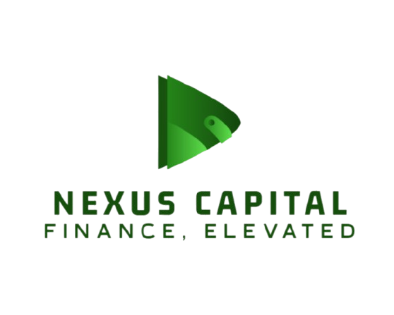
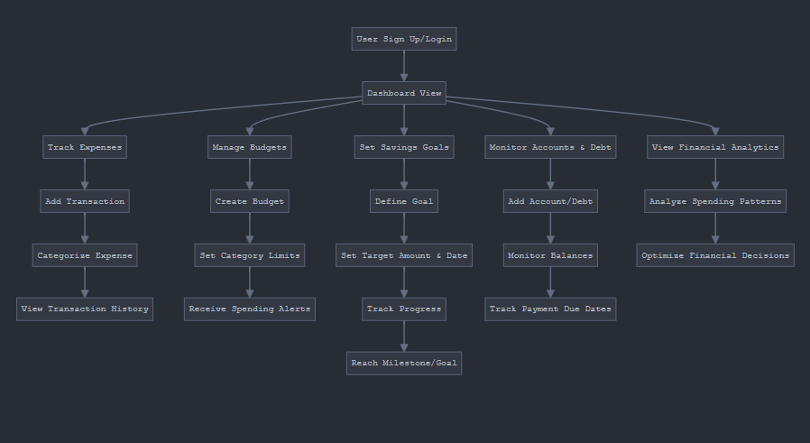

# Nexus Capital - Finance Management Platform

# WebSite Link :- https://nexus-capital-frontend.vercel.app/
# Frontend Link :- https://nexus-capital-frontend.vercel.app/
# Backend Link :- https://nexus-capital-frontend.vercel.app/





## Overview

Nexus Capital is a comprehensive personal finance management application designed to help users take control of their financial future. The platform provides powerful tools for tracking expenses, managing budgets, setting savings goals, and monitoring accounts and debts.

## Features

### 🧾 Expense Tracking
- **Categorized Transactions**: Log and categorize daily expenses with details like amount, category, and date
- **Flexible Categories**: Track spending across categories including Groceries, Utilities, Entertainment, Dining, Transportation, and more
- **Advanced Filtering**: Filter expenses by category, amount, and date range
- **Transaction History**: View complete transaction history with detailed information

### 💰 Budget Management
- **Custom Budgets**: Create personalized budgets for different spending categories
- **Spending Alerts**: Receive alerts when approaching or exceeding budget limits
- **Period Options**: Set budgets for weekly, monthly, or yearly periods
- **Progress Tracking**: Visual indicators of budget utilization and remaining funds
- **Budget Analysis**: Identify overspending patterns and optimize budget allocation

### 🎯 Savings Goals
- **Goal Setting**: Create savings goals with target amounts and dates
- **Progress Tracking**: Monitor progress toward financial goals with visual indicators
- **Priority Management**: Assign priorities to different savings goals
- **Timeline Visualization**: See projected completion dates and remaining time
- **Milestone Celebrations**: Celebrate achievements when reaching savings milestones

### 🏦 Account & Debt Management
- **Multiple Account Types**: Support for bank accounts, cash, credit cards, and digital wallets
- **Debt Tracking**: Monitor loans and credit card debts with interest rates
- **Payment Reminders**: Due date tracking and minimum payment information
- **Net Worth Calculation**: Automatic calculation of total assets, debts, and net worth
- **Account Balance History**: Track changes in account balances over time

### 📊 Financial Analysis & Trends
- **Visual Analytics**: Interactive charts and graphs for expense visualization
- **Category Distribution**: Analyze spending patterns across different categories
- **Time-based Analysis**: Track financial trends over time (monthly, quarterly, yearly)
- **Comparative Reports**: Compare spending across different time periods
- **Financial Health Indicators**: Key metrics to assess overall financial health

### 🌙 Dark Mode & Customization
- **Theme Options**: Toggle between light and dark modes for comfortable viewing
- **Persistent Preferences**: User theme preferences are saved between sessions
- **Responsive Design**: Optimized for both desktop and mobile viewing
- **Accessibility Features**: High contrast options and readable typography

## Technology Stack

### Frontend
- **Angular**: Modern, robust framework for building the user interface
- **Angular Material**: Comprehensive UI component library with Material Design
- **Chart.js**: Powerful, flexible charting library for data visualization
- **RxJS**: Reactive programming library for handling asynchronous operations

### Backend
- **Node.js**: JavaScript runtime for building the server-side application
- **Express.js**: Web framework for creating API endpoints and handling requests
- **MongoDB**: NoSQL database for storing user data, transactions, and financial information
- **Mongoose**: MongoDB object modeling for Node.js

### Authentication & Security
- **JWT (JSON Web Tokens)**: Secure authentication mechanism
- **bcrypt.js**: Password hashing for secure user authentication
- **CORS**: Cross-Origin Resource Sharing protection

## Installation

### Prerequisites
- Node.js (v14 or higher)
- MongoDB (local instance or MongoDB Atlas)
- Angular CLI

### Setup Instructions

1. **Clone the repository**
   ```bash
   git clone https://github.com/yourusername/nexus-capital.git
   cd nexus-capital
   ```

2. **Install dependencies for both client and server**
   ```bash
   # Install client dependencies
   cd moneymate-client
   npm install

   # Install server dependencies
   cd ../moneymate-server
   npm install
   ```

3. **Configure environment variables**
   - Create a `.env` file in the server directory with the following variables:
     ```
     PORT=5000
     MONGO_URI=your_mongodb_connection_string
     SECRETKEY=your_jwt_secret_key
     ```

4. **Start the development servers**
   ```bash
   # Start the backend server
   cd moneymate-server
   npm run dev

   # In a new terminal, start the frontend
   cd moneymate-client
   ng serve
   ```

5. **Access the application**
   - Frontend: http://localhost:4200
   - Backend API: http://localhost:5000

## Usage

1. **Create an account** or log in with existing credentials
2. **Dashboard**: View your financial overview and recent transactions
3. **Add transactions** to track your daily expenses
4. **Create budgets** to manage your spending in different categories
5. **Set savings goals** to work toward financial milestones
6. **Add accounts** to track your assets and liabilities
7. **View trends** to analyze your financial patterns over time

## Contributing

We welcome contributions to Nexus Capital! Please follow these steps:

1. Fork the repository
2. Create a feature branch (`git checkout -b feature/amazing-feature`)
3. Commit your changes (`git commit -m 'Add some amazing feature'`)
4. Push to the branch (`git push origin feature/amazing-feature`)
5. Open a Pull Request

## Acknowledgments

-Ayush
-Heramb
